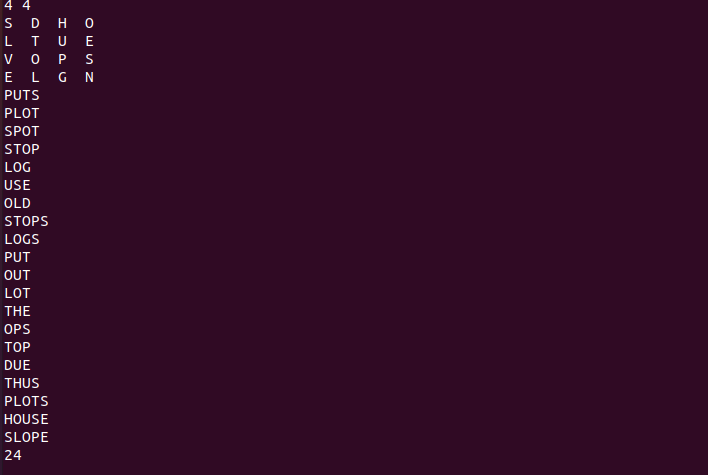

<h1 align="center">Boggle Solver</h1>
<h4 align="center">A program to play the word game Boggle</h4>
<h5>The Boggle Game</h5>

Boggle is a word game designed by Allan Turoff and distributed by Hasbro. It involves a board made up of 16 cubic dice, where each die has a letter printed on each of its 6 sides. At the beginning of the game, the 16 dice are shaken and randomly distributed into a 4-by-4 tray, with only the top sides of the dice visible. The players compete to accumulate points by building valid words from the dice, according to these rules: 

<ul>
  <li>A valid word must be composed by following a sequence of adjacent dice—two dice are adjacent if they are horizontal, vertical, or diagonal neighbors. </li>
  <li>A valid word can use each die at most once. </li>
  <li>A valid word must contain at least 3 letters. </li>
  <li>A valid word must be in the dictionary (which typically does not contain proper nouns).</li>
  </ul>
  A valid example is given below: 
 
 <h5>The Qu Special Case</h5>
 
In the English language, the letter Q is almost always followed by the letter U. Consequently, the side of one die is printed with the two-letter sequence Qu instead of Q (and this two-letter sequence must be used together when forming words). When scoring, Qu counts as two letters; for example, the word QuEUE scores as a 5-letter word even though it is formed by following a sequence of only 4 dice.

 <h5>Dictionaries Used</h5>
 
Two dictionaries used are included as .txt files. "dictionary-yawl.txt" is a comprehensive list of 264,061 English words (known as Yet Another Word List) that is widely used in word-game competitions. 

 <h5>Solution</h5>
 
TST is used to store the words in the dictionaries. Perform DFS on the board by searching for valid words in the trie. On an average, it was seen that 4000-5000 random 4x4 boards could be solved per second.

 <h5>Sample Output obtained for a random board (using the "dictionary-algs4.txt")</h5>
 
 

 
