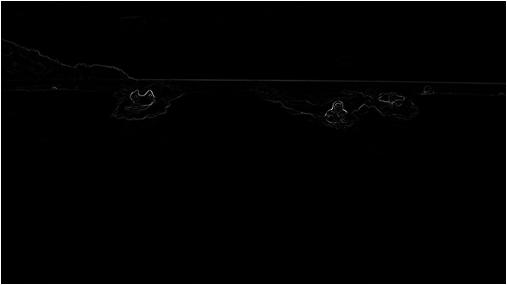
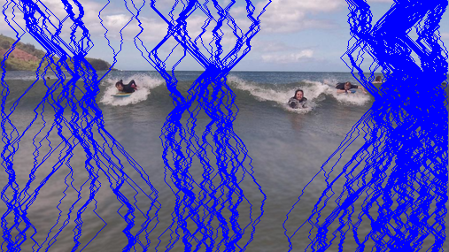
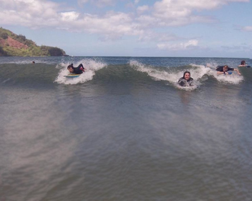

<h1 align="center">SEAM CARVING</h1>

Seam-carving is a content-aware image resizing technique where the image is reduced in size by one pixel of height (or width) at a time. A vertical seam in an 
image is a path of pixels connected from the top to the bottom with one pixel in each row; a horizontal seam is a path of pixels connected from the left to the right with one pixel in each column. The input image used is given below.

Finding and removing a seam involves four parts:

<ul>
  <li><h3>Notation</h3>
    
In image processing, pixel (x, y) refers to the pixel in column x and row y, with pixel (0, 0) at the upper left corner and pixel (W − 1, H − 1) at the bottom
      right corner.(opposite of the standard mathematical notation used in linear algebra where (i, j) refers to row i and column j and with Cartesian coordinates
      where (0, 0) is at the lower left corner.) The color of a pixel is represented in RGB space, using three integers between 0 and 255. 
</li>
  <li><h3>Energy Calculation</h3>
    
The dual-gradient energy function is implemented for this project. The dual-gradient energy function of the input image used:

    
  
The energy is high (white) for pixels in the image where there is a rapid color gradient (such as the boundary between the sea and sky and the boundary between the surfing Josh Hug on the left and the ocean behind him). The seam-carving technique avoids removing such high-energy pixels.
</li>

  <li><h3>Seam Identification</h3>
    
The next step is to find a vertical seam of minimum total energy. This is similar to the classic shortest path problem in an edge-weighted digraph.We need to find the shortest path from any of the W pixels in the top row to any of the W pixels in the bottom row. The digraph is acyclic, where there is a downward edge from pixel (x, y) to pixels (x − 1, y + 1), (x, y + 1), and (x + 1, y + 1), assuming that the coordinates are in the prescribed range. The seams to be removed are identified in the picture(shown below).

    
  </li>
  <li><h3>Seam Removal</h3>
    The final step is to remove from the image all of the pixels along the seam. The final image obtained is shown below. </li>
  </ul>
    
  
